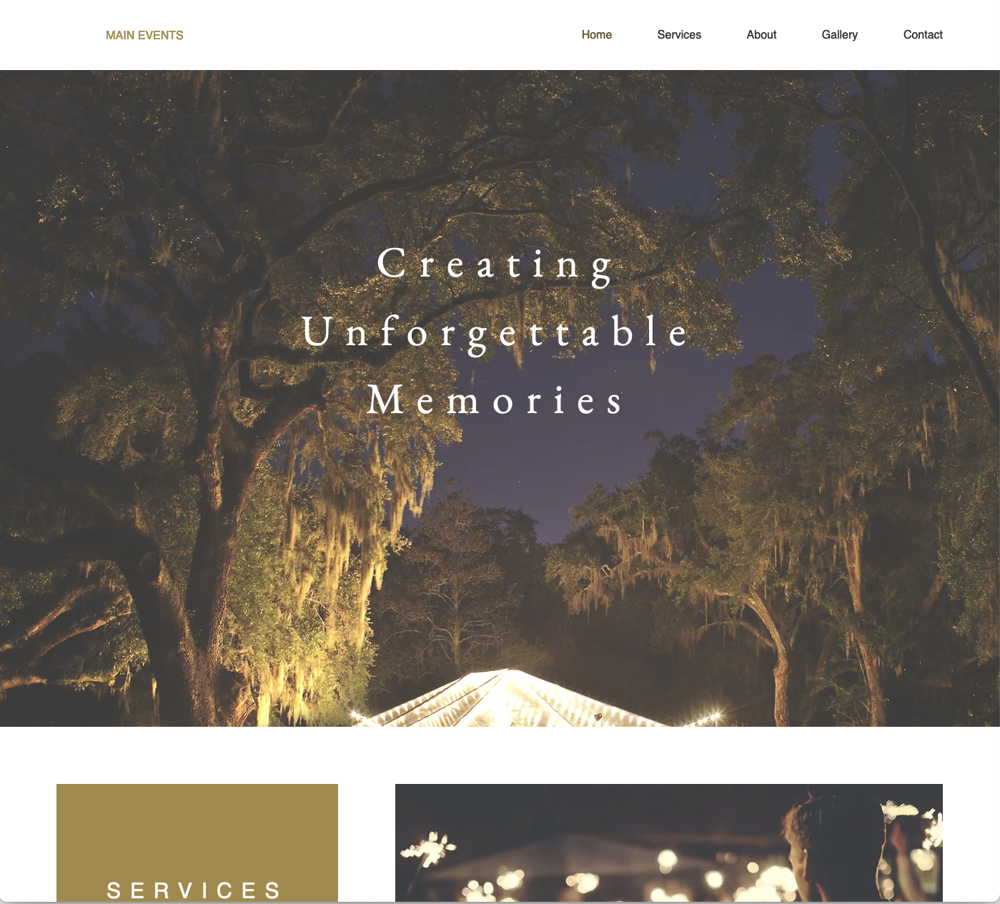

# Static Web Design Project – Course Assignment #1

This project is a static webpage I designed and developed as part of a web development course. It demonstrates my skills in responsive layout, UI design, and front-end development using HTML and CSS.

> **Note**: In compliance with course regulations and academic integrity policies, only partial code and assets are included. Please contact me directly if you'd like to review the full implementation (not available to current students enrolled in the course).

---

## Technologies Used

- HTML5
- CSS3 (custom styles, layout, transitions)
- Google Fonts
- Font Awesome Icons
- Figma (for initial UI mockups)

---

## Project Highlights

- **Responsive Navigation Bar** with hover animations
- **Fixed top-bar layout** with floating menu elements
- **Custom-designed UI sections** including gallery, testimonials, and services
- **Creative use of background images** and clip-paths for modern layout styling

---

## Screenshots

| Header Section | Gallery Section |
|--------------|------------------|
|  |  |

---

## 🧩 Partial Code Preview

```html
<!-- Responsive Navigation Bar (Partial) -->
<nav class="navbar">
  <ul class="navigation">
    <li><a href="#home">Home</a></li>
    <li><a href="#services">Services</a></li>
    <li><a href="#about">About</a></li>
  </ul>
</nav>

```CSS
/* Basic Reset and Typography */
a {
  text-decoration: none;
  color: black;
}

html {
  background-color: #FFFFFF;
  font-family: sans-serif;
}

body {
  width: 1239px;
  margin: 0;
  padding: 0;
  min-height: 600px;
}
---

## 📁 Project Structure (Shared)
project/
├── index.html
├── styles.css
├── images/
│   ├── header.png
│   ├── content.png
│   ├── flower.png
│   ├── flower2.png
│   ├── image1.png
│   ├── image2.png
│   └── image3.png
└── README.md

📩 Contact

If you’d like access to the full codebase (excluding currently enrolled students), please reach out:

📧 ihanghua@usc.edu; scream831003@gmail.com

🛡️ Disclaimer
This work is shared for educational and professional demonstration purposes only. Unauthorized copying or redistribution by currently enrolled students is strictly prohibited.
